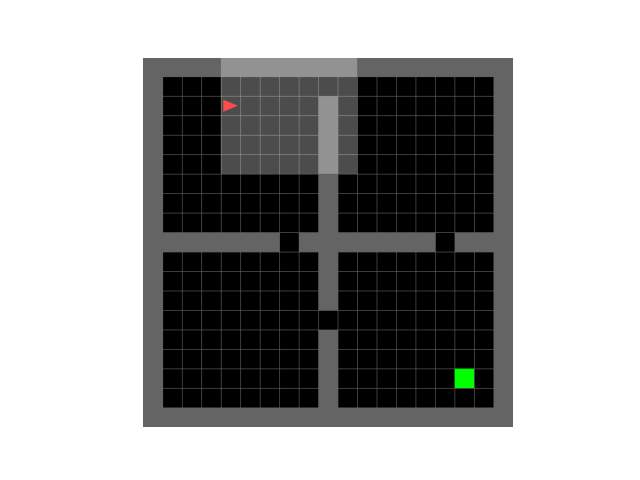
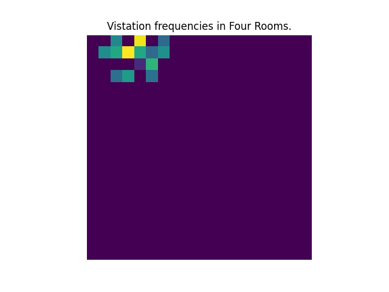

# RL Refresher

This repo is meant to contain a collection of some implementations that are both refreshers and algorithms I know about but have not implemented. 

They are meant to be standalone and as simple as possible, though I might factor out some very redundant tooling if necessary for readability.

## DreamerV3

Currently in development.

Model based agent detailed in: https://arxiv.org/pdf/2301.04104v1.pdf.

Simpler than MuZero, training happens in an actor-critic style. There is a encoder/decoder style world model that tries to learn a consistent latent state. There are action and value models that are trained separately that trained using some fancy tricks on relatively standard approahc that uses REINFORCE-style gradients for the actor and almost a distributional-return style value function.

## MuZero

Currently in development.

Implementation of the MuZero algorithm detailed in: https://arxiv.org/pdf/1911.08265.pdf. Replaces simulation procedure with prediction network, evnironment model with a dynamics network, and embeds the observations into a latent space to perform search. Trained to minimize the difference between state reward, MCTS-action distribution, and episode return.

## AlphaZero-style MCTS

Trains an agent similar to https://arxiv.org/pdf/1712.01815.pdf. Replaces the simulation procedure with a value network and the tree policy with a policy network that recurses down to an unexpanded node. Trained to minimize the difference from the actual episode return and also the policy priors from the MCTS-found action distribution.

Example of agent training on simple "Frozen Lake" environment. Using only 20 look-ahead steps, it is easily able to solve the environment (vs the over 5000 steps needed for vanilla MCTS).

## Monte Carlo Tree Search

MCTS rollout-based Value function in the 8x8 Frozen Lake environment.

And the learned search tree:

Testing out in the [Minigrid](https://github.com/Farama-Foundation/Minigrid/blob/master/minigrid/minigrid_env.py) environment suite. Example of the Four Rooms domain below:

Unfortunately, MCTS does rather poorly in this domain because of sparse rewards + high revisit factor (search tree is very cyclic). Visitation frequencies look something like this for a simple problem:

## PPO 
Original Paper: https://arxiv.org/pdf/1707.06347
Implementation based on CleanRL version: https://github.com/vwxyzjn/cleanrl/blob/master/cleanrl/ppo.py

Popular actor-critic style policy gradient algorithm that runs several rollouts in an evironment (using vectorized
environmnets), and optimizes a clipped version of the conservative policy iteration to prevent overly large updates.

## Deep Q Learning:

Simple convolutional DQN to play Atari pong. Examples in the code also solve common control problems like acrobot and cartpole.

## Q-Learning:

Tabular Q-Learning agent that learns to solve a slightly harder version of the common text-based domain Frozen Lake (8x8 vs 4x4 grid). Visualizing the return of a random vs learned agent and also value function learned by agent.

## Linear TD learning:

Currently in development.
