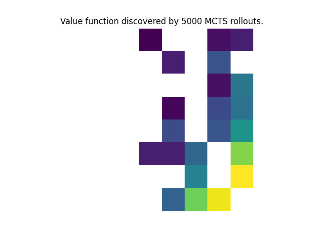

# RL Refresher

This repo is meant to contain a collection of some implementations that are both refreshers and algorithms I know about but have not implemented. 

They are meant to be standalone and as simple as possible, though I might factor out some very redundant tooling if necessary for readability.

## Q-Learning:

Tabular Q-Learning agent that learns to solve a slightly harder version of the common text-based domain Frozen Lake (8x8 vs 4x4 grid). Visualizing the return of a random vs learned agent and also value function learned by agent.

## Linear TD learning:

Currently in development.

## Deep Q Learning:

Simple convolutional DQN to play Atari pong. Examples in the code also solve common control problems like acrobot and cartpole.

## Monte Carlo Tree Search

MCTS rollout-based Value function in the 4x4 Frozen Lake environment.

In a variety of grid world environments, use a model to perform rollout-based search at each step. 
